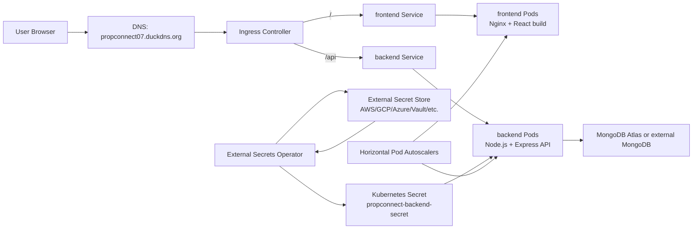

# PropConnect Kubernetes Deployment

This folder deploys PropConnect as a production-style Kubernetes application with separate frontend and backend workloads.

## Architecture



## Images

- Frontend: `pavansaipashikanti/propconnect-frontend:latest`
- Backend: `pavansaipashikanti/propconnect-backend:latest`

## Files And Why They Exist

| File | Purpose |
| --- | --- |
| `namespace.yaml` | Creates the isolated `propconnect` namespace. |
| `serviceaccount.yaml` | Runs app pods with a dedicated low-privilege service account. |
| `configmap.yaml` | Stores non-secret runtime config such as `NODE_ENV`, `PORT`, and `FRONTEND_URL`. |
| `externalsecret.yaml` | Pulls `MONGO_URI`, `JWT_SECRET`, and `JWT_EXPIRE` from an external secret manager into a Kubernetes Secret. |
| `backend-deployment.yaml` | Runs the Express API pods with probes, rolling updates, resource limits, and secret/config injection. |
| `backend-service.yaml` | Gives the backend pods a stable internal address on port `5000`. |
| `frontend-deployment.yaml` | Runs the Nginx/React frontend pods with probes, rolling updates, and resource limits. |
| `frontend-service.yaml` | Gives the frontend pods a stable internal address on port `80`. |
| `ingress.yaml` | Routes public traffic: `/` to frontend and `/api` to backend. |
| `backend-hpa.yaml` | Autoscaling rules for backend pods based on CPU and memory. |
| `frontend-hpa.yaml` | Autoscaling rules for frontend pods based on CPU. |
| `backend-pdb.yaml` | Keeps at least one backend pod available during voluntary disruptions. |
| `frontend-pdb.yaml` | Keeps at least one frontend pod available during voluntary disruptions. |
| `limitrange.yaml` | Sets default CPU and memory limits in the namespace. |
| `network-policy.yaml` | Restricts inbound traffic to frontend/backend pods. |
| `kustomization.yaml` | Lets you deploy the whole folder with one command. |
| `clustersecretstore-aws.example.yaml` | Example AWS Secrets Manager store for EKS IRSA or Pod Identity. Copy/apply only after configuring AWS IAM access. |
| `clustersecretstore-aws-killercoda.example.yaml` | Example AWS Secrets Manager store for Killercoda/testing using AWS access keys stored in Kubernetes. |


## Access Without A Paid Domain

You have three practical options:

| Option | Best For | How You Access It |
| --- | --- | --- |
| Port-forward | Quick local testing | `http://localhost:8080` |
| LoadBalancer address | Cloud cluster testing | Ingress external IP or cloud load balancer hostname |
| DuckDNS | Public demo without buying a domain | `https://propconnect07.duckdns.org` |

DuckDNS is a good choice for this project. You already created:

```text
propconnect07.duckdns.org
```

For a cloud Kubernetes cluster, point DuckDNS to the external IP of your ingress controller, not usually your laptop IP.

Find the ingress controller external address:

```bash
kubectl get svc -A
```

Look for the service used by your ingress controller, commonly `ingress-nginx-controller`. If it shows an external IP, copy that IP into DuckDNS as the current IP.

Then confirm DNS resolves:

```bash
nslookup propconnect07.duckdns.org
```

For quick testing before DNS is ready, use port-forward:

```bash
kubectl -n propconnect port-forward svc/propconnect-frontend 8080:80
```

Open:

```text
http://localhost:8080
```

The frontend can load, but full `/api` routing through ingress is best tested through the ingress host after DuckDNS points to the ingress address.

### TLS Note

The current ingress is production-oriented and expects this TLS secret:

```text
propconnect-tls
```

For HTTPS on DuckDNS, install cert-manager and create a certificate for `propconnect07.duckdns.org`, or manually create the `propconnect-tls` secret.

If you only want a temporary HTTP test, change `nginx.ingress.kubernetes.io/ssl-redirect` to `"false"` in `ingress.yaml` and remove the `tls` block. Keep HTTPS for production.

## Required Cluster Add-ons

Install these before applying this folder. These are cluster-level components, so you normally install them once per Kubernetes cluster, not once per app.

### 1. External Secrets Operator

External Secrets Operator syncs secrets from an external secret manager into Kubernetes Secrets. In this project, `externalsecret.yaml` uses it to create `propconnect-backend-secret`, which gives the backend `MONGO_URI`, `JWT_SECRET`, and `JWT_EXPIRE` without committing secret values into Git.

Install with Helm:

```bash
helm repo add external-secrets https://charts.external-secrets.io
helm repo update
helm install external-secrets external-secrets/external-secrets \
  -n external-secrets \
  --create-namespace
```

Verify:

```bash
kubectl -n external-secrets get pods
kubectl get crd | grep external-secrets
```

After installing the operator, create a `ClusterSecretStore` for your provider, such as AWS Secrets Manager, GCP Secret Manager, Azure Key Vault, Vault, or another supported store. This repo expects the store name to be `propconnect-secret-store`.

### 2. NGINX Ingress Controller

The ingress controller receives public HTTP/HTTPS traffic and routes it to Kubernetes services. In this project, `ingress.yaml` sends `/` to the frontend service and `/api` to the backend service. The manifests use `ingressClassName: nginx`, so the cluster needs an ingress controller using that class.

Install with Helm:

```bash
helm repo add ingress-nginx https://kubernetes.github.io/ingress-nginx
helm repo update
helm install ingress-nginx ingress-nginx/ingress-nginx \
  -n ingress-nginx \
  --create-namespace
```

Verify:

```bash
kubectl -n ingress-nginx get pods
kubectl -n ingress-nginx get svc ingress-nginx-controller
```

For DuckDNS, copy the external IP or load balancer hostname from `ingress-nginx-controller` and point `propconnect07.duckdns.org` to it.

### 3. Metrics Server

Metrics Server provides CPU and memory usage metrics to Kubernetes. The `backend-hpa.yaml` and `frontend-hpa.yaml` files need it so the Horizontal Pod Autoscalers can scale pods up or down.

Install with the official manifest:

```bash
kubectl apply -f https://github.com/kubernetes-sigs/metrics-server/releases/latest/download/components.yaml
```

Verify:

```bash
kubectl -n kube-system get pods | grep metrics-server
kubectl top nodes
kubectl top pods -n propconnect
```

If `kubectl top` does not work immediately, wait a minute and try again.

### 4. TLS Secret Or cert-manager

The ingress is configured for HTTPS and expects a TLS secret named `propconnect-tls` in the `propconnect` namespace. For production, use cert-manager so certificates can be issued and renewed automatically. For a quick manual setup, you can create the TLS secret yourself.

Recommended: install cert-manager with Helm:

```bash
helm repo add jetstack https://charts.jetstack.io --force-update
helm repo update
helm install cert-manager jetstack/cert-manager \
  --namespace cert-manager \
  --create-namespace \
  --set crds.enabled=true
```

Verify:

```bash
kubectl -n cert-manager get pods
kubectl get crd | grep cert-manager
```

Manual TLS secret option, if you already have certificate files:

```bash
kubectl -n propconnect create secret tls propconnect-tls \
  --cert=fullchain.pem \
  --key=privkey.pem
```

For DuckDNS with cert-manager, you will also need an `Issuer` or `ClusterIssuer` configured for ACME/Let's Encrypt. DNS-01 is usually the cleanest option for dynamic DNS, while HTTP-01 can work if your ingress is already publicly reachable on port 80.
## How AWS Authentication Works

You do not run `aws configure` inside the app pods or inside the External Secrets Operator pod.

`aws configure` is only for your local machine when you are using the AWS CLI manually. Kubernetes needs its own AWS identity.

Production flow:

```text
External Secrets Operator pod
        |
        | uses IAM role through EKS IRSA or EKS Pod Identity
        v
AWS Secrets Manager
        |
        | reads propconnect/production/backend
        v
Kubernetes Secret: propconnect-backend-secret
        |
        v
Backend pod environment variables
```

Recommended for EKS: use IAM Roles for Service Accounts (IRSA) or EKS Pod Identity. This gives the External Secrets Operator short-lived AWS credentials automatically, without storing AWS access keys in Kubernetes.

Minimum IAM policy for this app:

```json
{
  "Version": "2012-10-17",
  "Statement": [
    {
      "Effect": "Allow",
      "Action": [
        "secretsmanager:GetResourcePolicy",
        "secretsmanager:GetSecretValue",
        "secretsmanager:DescribeSecret",
        "secretsmanager:ListSecretVersionIds"
      ],
      "Resource": "arn:aws:secretsmanager:ap-south-1:ACCOUNT_ID:secret:propconnect/production/backend-*"
    }
  ]
}
```

Replace:

- `ap-south-1` with your AWS region
- `ACCOUNT_ID` with your AWS account ID

If you install External Secrets Operator with IRSA, the Helm install usually includes a service account role annotation like this:

```bash
helm install external-secrets external-secrets/external-secrets \
  -n external-secrets \
  --create-namespace \
  --set serviceAccount.annotations."eks\.amazonaws\.com/role-arn"="arn:aws:iam::ACCOUNT_ID:role/propconnect-external-secrets-role"
```

After that, apply a `ClusterSecretStore` that points to AWS Secrets Manager. A starter example is included here:

```text
k8s/clustersecretstore-aws.example.yaml
```

Copy it or apply it after replacing the region if needed:

```bash
kubectl apply -f k8s/clustersecretstore-aws.example.yaml
```

For quick non-production testing, External Secrets also supports storing AWS access keys in a Kubernetes Secret and referencing them from a SecretStore. Avoid that for production if IRSA or Pod Identity is available.
## AWS IAM Setup From Console

There are two practical paths depending on where the cluster runs.

### Production EKS Path: IAM Role

Use this when your Kubernetes cluster is EKS. This is the production-grade option because the External Secrets Operator receives short-lived credentials through IRSA or EKS Pod Identity.

From the AWS Console:

1. Open **IAM**.
2. Go to **Policies**.
3. Choose **Create policy**.
4. Choose **JSON** and paste this policy, replacing `ACCOUNT_ID` and region if needed:

```json
{
  "Version": "2012-10-17",
  "Statement": [
    {
      "Effect": "Allow",
      "Action": [
        "secretsmanager:GetResourcePolicy",
        "secretsmanager:GetSecretValue",
        "secretsmanager:DescribeSecret",
        "secretsmanager:ListSecretVersionIds"
      ],
      "Resource": "arn:aws:secretsmanager:ap-south-1:ACCOUNT_ID:secret:propconnect/production/backend-*"
    }
  ]
}
```

5. Name the policy something like `PropConnectExternalSecretsReadPolicy`.
6. Go to **Roles**.
7. Choose **Create role**.
8. For EKS IRSA, choose **Web identity** and select your EKS cluster OIDC provider.
9. For EKS Pod Identity, create a normal role that can be associated with the `external-secrets` service account.
10. Attach `PropConnectExternalSecretsReadPolicy`.
11. Name the role something like `propconnect-external-secrets-role`.
12. Attach that role to the External Secrets Operator service account using IRSA annotation or EKS Pod Identity association.

Then use:

```text
k8s/clustersecretstore-aws.example.yaml
```

### Killercoda Path: IAM User Access Key

Killercoda is not EKS and is not running with an AWS IAM identity, so an IAM role alone will not authenticate the pod. For Killercoda, the simplest learning setup is an IAM user access key stored as a Kubernetes Secret.

This is acceptable for a temporary playground. Do not use this as the preferred production pattern.

From the AWS Console:

1. Open **IAM**.
2. Go to **Policies**.
3. Create the same policy shown above.
4. Go to **Users**.
5. Choose **Create user**.
6. Name it something like `propconnect-external-secrets-killercoda`.
7. Attach `PropConnectExternalSecretsReadPolicy` directly to this user.
8. Open the user and go to **Security credentials**.
9. Create an **Access key**.
10. Copy the access key ID and secret access key.

In Killercoda, create the Kubernetes Secret in the same namespace where External Secrets Operator is installed:

```bash
kubectl create namespace external-secrets --dry-run=client -o yaml | kubectl apply -f -

kubectl -n external-secrets create secret generic awssm-secret \
  --from-literal=access-key='YOUR_AWS_ACCESS_KEY_ID' \
  --from-literal=secret-access-key='YOUR_AWS_SECRET_ACCESS_KEY'
```

Then apply the Killercoda store example:

```bash
kubectl apply -f k8s/clustersecretstore-aws-killercoda.example.yaml
```

After that, `k8s/externalsecret.yaml` can use `propconnect-secret-store` to pull from AWS Secrets Manager.

When you are done with the playground, delete or deactivate the AWS access key from the IAM user.
## External Secrets Requirement

`externalsecret.yaml` expects a `ClusterSecretStore` named:

```text
propconnect-secret-store
```

The remote secret should be named:

```text
propconnect/production/backend
```

It should contain:

```text
MONGO_URI
JWT_SECRET
JWT_EXPIRE
```

Example values:

```text
MONGO_URI=mongodb+srv://...
JWT_SECRET=replace-with-a-long-random-secret
JWT_EXPIRE=30d
```

The `ClusterSecretStore` is not included here because it is provider-specific. AWS Secrets Manager, GCP Secret Manager, Azure Key Vault, Vault, and other providers all use different authentication settings.

## Before You Run

Review these values before applying to a real cluster:

- `propconnect07.duckdns.org` in `configmap.yaml` and `ingress.yaml`; this is already set for your DuckDNS domain
- `propconnect-secret-store` in `externalsecret.yaml` if your store has a different name
- `ingressClassName: nginx` in `ingress.yaml` if your cluster uses another ingress class
- `ingress-nginx` namespace selectors in `network-policy.yaml` if your ingress controller is in another namespace

## How To Run

From the repository root:

```bash
kubectl apply -k k8s/
```

Then check the rollout:

```bash
kubectl -n propconnect rollout status deployment/propconnect-backend
kubectl -n propconnect rollout status deployment/propconnect-frontend
```

Check that External Secrets created the runtime secret:

```bash
kubectl -n propconnect get externalsecret
kubectl -n propconnect get secret propconnect-backend-secret
```

Check pods, services, and ingress:

```bash
kubectl -n propconnect get pods
kubectl -n propconnect get svc
kubectl -n propconnect get ingress
```

## Smoke Test

Once DNS points to the ingress load balancer, test:

```bash
curl -I https://propconnect07.duckdns.org/
curl https://propconnect07.duckdns.org/api/health
```

Expected backend health response includes:

```json
{
  "success": true
}
```

## Useful Debug Commands

```bash
kubectl -n propconnect describe externalsecret propconnect-backend
kubectl -n propconnect describe deployment propconnect-backend
kubectl -n propconnect logs deployment/propconnect-backend
kubectl -n propconnect logs deployment/propconnect-frontend
```

## Remove Deployment

```bash
kubectl delete -k k8s/
```


