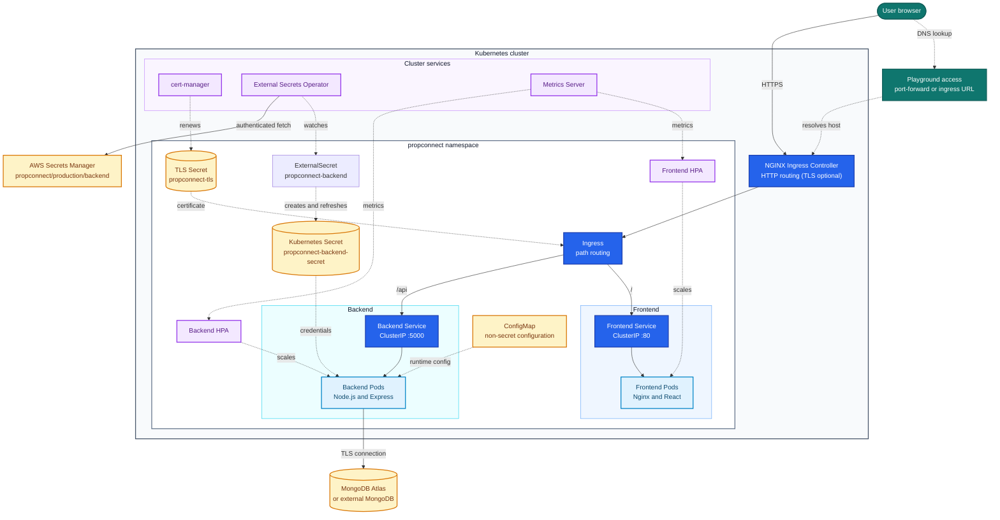

# PropConnect Kubernetes Deployment

This folder deploys PropConnect as a production-style Kubernetes application with separate frontend and backend workloads.

## Architecture



## Images

- Frontend: `pavansaipashikanti/propconnect-frontend:latest`
- Backend: `pavansaipashikanti/propconnect-backend:latest`

## Files And Why They Exist

| File | Purpose |
| --- | --- |
| `namespace.yaml` | Creates the isolated `propconnect` namespace. |
| `serviceaccount.yaml` | Runs app pods with a dedicated low-privilege service account. |
| `configmap.yaml` | Stores non-secret runtime config such as `NODE_ENV`, `PORT`, and `FRONTEND_URL`. |
| `externalsecret.yaml` | Pulls `MONGO_URI`, `JWT_SECRET`, and `JWT_EXPIRE` from an external secret manager into a Kubernetes Secret. |
| `backend-deployment.yaml` | Runs the Express API pods with probes, rolling updates, resource limits, and secret/config injection. |
| `backend-service.yaml` | Gives the backend pods a stable internal address on port `5000`. |
| `frontend-deployment.yaml` | Runs the Nginx/React frontend pods with probes, rolling updates, and resource limits. |
| `frontend-service.yaml` | Gives the frontend pods a stable internal address on port `80`. |
| `ingress.yaml` | Routes public traffic: `/` to frontend and `/api` to backend. |
| `backend-hpa.yaml` | Autoscaling rules for backend pods based on CPU and memory. |
| `frontend-hpa.yaml` | Autoscaling rules for frontend pods based on CPU. |
| `backend-pdb.yaml` | Keeps at least one backend pod available during voluntary disruptions. |
| `frontend-pdb.yaml` | Keeps at least one frontend pod available during voluntary disruptions. |
| `limitrange.yaml` | Sets default CPU and memory limits in the namespace. |
| `network-policy.yaml` | Restricts inbound traffic to frontend/backend pods. |
| `kustomization.yaml` | Lets you deploy the whole folder with one command. |
| `clustersecretstore-aws.example.yaml` | Example AWS Secrets Manager store for EKS IRSA or Pod Identity. Copy/apply only after configuring AWS IAM access. |
| `clustersecretstore-aws-killercoda.example.yaml` | Example AWS Secrets Manager store for Killercoda/testing using AWS access keys stored in Kubernetes. |

## What Is Actually Used Right Now

The active deployment bundle is the resource list in [`k8s/kustomization.yaml`](D:\propconnect\actions-gha\propconnect\k8s\kustomization.yaml). Right now it includes:

- `serviceaccount.yaml`
- `configmap.yaml`
- `externalsecret.yaml`
- `backend-deployment.yaml`
- `backend-service.yaml`
- `frontend-deployment.yaml`
- `frontend-service.yaml`
- `ingress.yaml`
- `backend-hpa.yaml`
- `frontend-hpa.yaml`
- `backend-pdb.yaml`
- `frontend-pdb.yaml`
- `limitrange.yaml`
- `network-policy.yaml`

`namespace.yaml` still exists in the folder, but it is commented out in `kustomization.yaml`, so it is not part of the active app sync right now.

That means there are two valid ways to handle the namespace:

1. Let Argo CD create it with `CreateNamespace=true`
2. Create it manually once before running `kubectl apply -k k8s/`

For the current learning setup, option 2 is the least confusing if you are applying manifests directly.

## Suggested Step-by-Step Flow

1. Install the required cluster add-ons:
   - External Secrets Operator
   - NGINX Ingress Controller
   - Metrics Server
   - cert-manager or a manually created TLS secret
2. Create the `propconnect` namespace if you are applying locally with `kubectl`.
3. Make sure your external secret store exists and is named `propconnect-secret-store`.
4. Make sure the remote secret `propconnect/production/backend` exists in AWS Secrets Manager or your chosen provider.
5. Apply the app manifests with `kubectl apply -k k8s/` or let Argo CD sync the folder.
6. Wait for `propconnect-backend-secret` to be created by External Secrets.
7. Check that backend and frontend pods become ready.
8. Verify service endpoints and ingress.
9. Access the frontend with port-forward for local testing, or through ingress for public testing.

## Current Manifest Dependency Order

The bundle works best in this order:

1. `namespace.yaml` only if you are creating the namespace manually
2. `serviceaccount.yaml`
3. `configmap.yaml`
4. `externalsecret.yaml`
5. `backend-deployment.yaml`
6. `backend-service.yaml`
7. `frontend-deployment.yaml`
8. `frontend-service.yaml`
9. `ingress.yaml`
10. `backend-hpa.yaml`
11. `frontend-hpa.yaml`
12. `backend-pdb.yaml`
13. `frontend-pdb.yaml`
14. `limitrange.yaml`
15. `network-policy.yaml`

In practice, `kustomization.yaml` handles the apply order, but this list shows the dependency flow so the setup is easier to reason about.


## Playground Access

For this repo there are two clean ways to open the app in a playground.

### Option A. Simplest path

Port-forward the frontend service:

```bash
kubectl -n propconnect port-forward --address 0.0.0.0 svc/propconnect-frontend 8080:80
```

Then expose port `8080` in the playground UI and open the generated browser URL.

Use this path when you just want the app running and do not care about ingress internals yet. It also matches the current frontend configuration, which expects the app to be reached from `http://localhost:8080`.

### Option B. Ingress learning path

If you want to practice ingress, port-forward the ingress controller service instead:

```bash
kubectl -n ingress-nginx port-forward --address 0.0.0.0 svc/ingress-nginx-controller 8081:80
```

Then expose port `8081` in the playground UI and open the generated browser URL.

Ingress routes:

- `/` -> frontend
- `/api` -> backend

### MetalLB IP note

`172.30.255.240` is the internal MetalLB address for the ingress controller. In most playgrounds you cannot browse that IP directly from your laptop browser. Use the playground port exposure step above to get a browser URL.

Useful local checks:

```bash
curl http://localhost:8080/
curl http://localhost:8080/api/health
curl http://127.0.0.1:8081/
curl http://127.0.0.1:8081/api/health
```

## Required Cluster Add-ons

Install these before applying this folder. These are cluster-level components, so you normally install them once per Kubernetes cluster, not once per app.

### 1. External Secrets Operator

External Secrets Operator syncs secrets from an external secret manager into Kubernetes Secrets. In this project, `externalsecret.yaml` uses it to create `propconnect-backend-secret`, which gives the backend `MONGO_URI`, `JWT_SECRET`, and `JWT_EXPIRE` without committing secret values into Git.

Install with Helm:

```bash
helm repo add external-secrets https://charts.external-secrets.io
helm repo update
helm install external-secrets external-secrets/external-secrets \
  -n external-secrets \
  --create-namespace
```

Verify:

```bash
kubectl -n external-secrets get pods
kubectl get crd | grep external-secrets
```

After installing the operator, create a `ClusterSecretStore` for your provider, such as AWS Secrets Manager, GCP Secret Manager, Azure Key Vault, Vault, or another supported store. This repo expects the store name to be `propconnect-secret-store`.

### 2. NGINX Ingress Controller

The ingress controller receives public HTTP/HTTPS traffic and routes it to Kubernetes services. In this project, `ingress.yaml` sends `/` to the frontend service and `/api` to the backend service. The manifests use `ingressClassName: nginx`, so the cluster needs an ingress controller using that class.

Install with Helm:

```bash
helm repo add ingress-nginx https://kubernetes.github.io/ingress-nginx
helm repo update
helm install ingress-nginx ingress-nginx/ingress-nginx \
  -n ingress-nginx \
  --create-namespace
```

Verify:

```bash
kubectl -n ingress-nginx get pods
kubectl -n ingress-nginx get svc ingress-nginx-controller
```

For playground use, do not browse the MetalLB IP directly from your laptop. If you want to learn ingress routing, port-forward the ingress controller service and expose that port in the playground UI.

### 3. Metrics Server

Metrics Server provides CPU and memory usage metrics to Kubernetes. The `backend-hpa.yaml` and `frontend-hpa.yaml` files need it so the Horizontal Pod Autoscalers can scale pods up or down.

This repo works with Kubernetes `v1.31+`. Check your cluster version first:

```bash
kubectl version
```

If the server version is `1.31` or newer, the latest Metrics Server manifest is fine. For example, the Killercoda cluster used during testing reports `Server Version: v1.35.1`.

Install with the official manifest:

```bash
kubectl apply -f https://github.com/kubernetes-sigs/metrics-server/releases/latest/download/components.yaml
```

Verify:

```bash
kubectl -n kube-system get pods | grep metrics-server
kubectl top nodes
kubectl top pods -n propconnect
```

If `kubectl top` does not work immediately, wait a minute and try again.

If the `metrics-server` pod stays at `0/1` and the logs show this error:

```text
x509: cannot validate certificate for <node-ip> because it doesn't contain any IP SANs
```

then the cluster's kubelet certificates are not trusted for direct scrape traffic. This is common in playground clusters like Killercoda.

Patch the deployment and add these args:

```bash
kubectl -n kube-system edit deployment metrics-server
```

```yaml
- --kubelet-insecure-tls
- --kubelet-preferred-address-types=InternalIP,Hostname,InternalDNS
```

Then restart and verify again:

```bash
kubectl -n kube-system rollout restart deployment metrics-server
kubectl -n kube-system rollout status deployment metrics-server
kubectl top nodes
```

### 4. TLS Secret Or cert-manager

The ingress is configured for HTTPS and expects a TLS secret named `propconnect-tls` in the `propconnect` namespace. For production, use cert-manager so certificates can be issued and renewed automatically. For a quick manual setup, you can create the TLS secret yourself.

Recommended: install cert-manager with Helm:

```bash
helm repo add jetstack https://charts.jetstack.io --force-update
helm repo update
helm install cert-manager jetstack/cert-manager \
  --namespace cert-manager \
  --create-namespace \
  --set crds.enabled=true
```

Verify:

```bash
kubectl -n cert-manager get pods
kubectl get crd | grep cert-manager
```

Manual TLS secret option, if you already have certificate files:

```bash
kubectl -n propconnect create secret tls propconnect-tls \
  --cert=fullchain.pem \
  --key=privkey.pem
```

If you use cert-manager with a real public domain, you will also need an `Issuer` or `ClusterIssuer` configured for ACME/Let's Encrypt. DNS-01 is usually the cleanest option for a public domain, while HTTP-01 can work if your ingress is already publicly reachable on port 80.

### 5. MetalLB

MetalLB gives `LoadBalancer` services a real IP in bare-metal or playground clusters that do not have a cloud load balancer. In this project, it is the piece that turns the `ingress-nginx-controller` service from `EXTERNAL-IP: <pending>` into an address you can actually browse.

Install it with the helper script:

```bash
bash k8s/install-metallb.sh
```

What the script does:

1. Installs MetalLB into `metallb-system`.
2. Applies `k8s/metallb-pool.yaml`, which defines the IP range MetalLB is allowed to hand out.
3. Ensures the ingress controller service is a `LoadBalancer`.

Verify:

```bash
kubectl -n metallb-system get pods
kubectl -n metallb-system get ipaddresspool,l2advertisement
kubectl -n ingress-nginx get svc ingress-nginx-controller -o wide
```

Important: `k8s/metallb-pool.yaml` contains a placeholder address range. Replace it with a free range from your lab or bare-metal network before using it for real. If the range conflicts with something else in the cluster, the ingress IP may never come up.

If you are only using `kubectl port-forward`, MetalLB is not required. You need MetalLB when you want the ingress controller itself to expose a real IP without relying on a cloud provider.

## How AWS Authentication Works
You do not run `aws configure` inside the app pods or inside the External Secrets Operator pod.

`aws configure` is only for your local machine when you are using the AWS CLI manually. Kubernetes needs its own AWS identity.

Production flow:

```text
External Secrets Operator pod
        |
        | uses IAM role through EKS IRSA or EKS Pod Identity
        v
AWS Secrets Manager
        |
        | reads propconnect/production/backend
        v
Kubernetes Secret: propconnect-backend-secret
        |
        v
Backend pod environment variables
```

Recommended for EKS: use IAM Roles for Service Accounts (IRSA) or EKS Pod Identity. This gives the External Secrets Operator short-lived AWS credentials automatically, without storing AWS access keys in Kubernetes.

Minimum IAM policy for this app:

```json
{
  "Version": "2012-10-17",
  "Statement": [
    {
      "Effect": "Allow",
      "Action": [
        "secretsmanager:GetResourcePolicy",
        "secretsmanager:GetSecretValue",
        "secretsmanager:DescribeSecret",
        "secretsmanager:ListSecretVersionIds"
      ],
      "Resource": "arn:aws:secretsmanager:ap-south-1:ACCOUNT_ID:secret:propconnect/production/backend-*"
    }
  ]
}
```

Replace:

- `ap-south-1` with your AWS region
- `ACCOUNT_ID` with your AWS account ID

If you install External Secrets Operator with IRSA, the Helm install usually includes a service account role annotation like this:

```bash
helm install external-secrets external-secrets/external-secrets \
  -n external-secrets \
  --create-namespace \
  --set serviceAccount.annotations."eks\.amazonaws\.com/role-arn"="arn:aws:iam::ACCOUNT_ID:role/propconnect-external-secrets-role"
```

After that, apply a `ClusterSecretStore` that points to AWS Secrets Manager. A starter example is included here:

```text
k8s/clustersecretstore-aws.example.yaml
```

Copy it or apply it after replacing the region if needed:

```bash
kubectl apply -f k8s/clustersecretstore-aws.example.yaml
```

For quick non-production testing, External Secrets also supports storing AWS access keys in a Kubernetes Secret and referencing them from a SecretStore. Avoid that for production if IRSA or Pod Identity is available.
## AWS IAM Setup From Console

There are two practical paths depending on where the cluster runs.

### Production EKS Path: IAM Role

Use this when your Kubernetes cluster is EKS. This is the production-grade option because the External Secrets Operator receives short-lived credentials through IRSA or EKS Pod Identity.

From the AWS Console:

1. Open **IAM**.
2. Go to **Policies**.
3. Choose **Create policy**.
4. Choose **JSON** and paste this policy, replacing `ACCOUNT_ID` and region if needed:

```json
{
  "Version": "2012-10-17",
  "Statement": [
    {
      "Effect": "Allow",
      "Action": [
        "secretsmanager:GetResourcePolicy",
        "secretsmanager:GetSecretValue",
        "secretsmanager:DescribeSecret",
        "secretsmanager:ListSecretVersionIds"
      ],
      "Resource": "arn:aws:secretsmanager:ap-south-1:ACCOUNT_ID:secret:propconnect/production/backend-*"
    }
  ]
}
```

5. Name the policy something like `PropConnectExternalSecretsReadPolicy`.
6. Go to **Roles**.
7. Choose **Create role**.
8. For EKS IRSA, choose **Web identity** and select your EKS cluster OIDC provider.
9. For EKS Pod Identity, create a normal role that can be associated with the `external-secrets` service account.
10. Attach `PropConnectExternalSecretsReadPolicy`.
11. Name the role something like `propconnect-external-secrets-role`.
12. Attach that role to the External Secrets Operator service account using IRSA annotation or EKS Pod Identity association.

Then use:

```text
k8s/clustersecretstore-aws.example.yaml
```

### Killercoda Path: IAM User Access Key

Killercoda is not EKS and is not running with an AWS IAM identity, so an IAM role alone will not authenticate the pod. For Killercoda, the simplest learning setup is an IAM user access key stored as a Kubernetes Secret.

This is acceptable for a temporary playground. Do not use this as the preferred production pattern.

From the AWS Console:

1. Open **IAM**.
2. Go to **Policies**.
3. Create the same policy shown above.
4. Go to **Users**.
5. Choose **Create user**.
6. Name it something like `propconnect-external-secrets-killercoda`.
7. Attach `PropConnectExternalSecretsReadPolicy` directly to this user.
8. Open the user and go to **Security credentials**.
9. Create an **Access key**.
10. Copy the access key ID and secret access key.

In Killercoda, create the Kubernetes Secret in the same namespace where External Secrets Operator is installed:

```bash
kubectl create namespace external-secrets --dry-run=client -o yaml | kubectl apply -f -

kubectl -n external-secrets create secret generic awssm-secret \
  --from-literal=access-key='YOUR_AWS_ACCESS_KEY_ID' \
  --from-literal=secret-access-key='YOUR_AWS_SECRET_ACCESS_KEY'
```

Then apply the Killercoda store example:

```bash
kubectl apply -f k8s/clustersecretstore-aws-killercoda.example.yaml
```

After that, `k8s/externalsecret.yaml` can use `propconnect-secret-store` to pull from AWS Secrets Manager.

When you are done with the playground, delete or deactivate the AWS access key from the IAM user.
## External Secrets Requirement

`externalsecret.yaml` expects a `ClusterSecretStore` named:

```text
propconnect-secret-store
```

The remote secret should be named:

```text
propconnect/production/backend
```

It should contain:

```text
MONGO_URI
JWT_SECRET
JWT_EXPIRE
```

Example values:

```text
MONGO_URI=mongodb+srv://...
JWT_SECRET=replace-with-a-long-random-secret
JWT_EXPIRE=30d
```

The `ClusterSecretStore` is not included here because it is provider-specific. AWS Secrets Manager, GCP Secret Manager, Azure Key Vault, Vault, and other providers all use different authentication settings.

## Bootstrap Script

For Killercoda, you can install the cluster add-ons and the AWS secret-store wiring with one script:

```bash
chmod +x k8s/bootstrap-killercoda.sh
AWS_ACCESS_KEY_ID=YOUR_AWS_ACCESS_KEY_ID \
AWS_SECRET_ACCESS_KEY=YOUR_AWS_SECRET_ACCESS_KEY \
AWS_REGION=ap-south-2 \
./k8s/bootstrap-killercoda.sh
```

What it installs:

- External Secrets Operator
- NGINX Ingress Controller
- Metrics Server with the kubelet TLS workaround for playground clusters
- cert-manager
- `awssm-secret` in the `external-secrets` namespace
- `propconnect-secret-store`

The script uses `ap-south-2` by default. Override `AWS_REGION` only if your secret lives in another AWS region.

## Before You Run

Review these values before applying to a real cluster:

- `FRONTEND_URL` in `configmap.yaml` if you want the frontend service to be reachable from a different browser origin; the current value is tuned for local port-forward access
- `propconnect-secret-store` in `externalsecret.yaml` if your store has a different name
- `ingressClassName: nginx` in `ingress.yaml` if your cluster uses another ingress class
- `ingress-nginx` namespace selectors in `network-policy.yaml` if your ingress controller is in another namespace

## How To Run

From the repository root:

```bash
kubectl apply -k k8s/
```

Then check the rollout:

```bash
kubectl -n propconnect rollout status deployment/propconnect-backend
kubectl -n propconnect rollout status deployment/propconnect-frontend
```

Check that External Secrets created the runtime secret:

```bash
kubectl -n propconnect get externalsecret
kubectl -n propconnect get secret propconnect-backend-secret
```

Check pods, services, and ingress:

```bash
kubectl -n propconnect get pods
kubectl -n propconnect get svc
kubectl -n propconnect get ingress
```

## Smoke Test

If you are using the frontend port-forward path, test:

```bash
curl -I http://localhost:8080/
curl http://localhost:8080/api/health
```

If you are using the ingress path, test from the playground terminal against the exposed ingress URL or with `curl` to `http://127.0.0.1:8081/` after the ingress controller port-forward is running.

Expected backend health response includes:

```json
{
  "success": true
}
```

## Useful Debug Commands

```bash
kubectl -n propconnect describe externalsecret propconnect-backend
kubectl -n propconnect describe deployment propconnect-backend
kubectl -n propconnect logs deployment/propconnect-backend
kubectl -n propconnect logs deployment/propconnect-frontend
kubectl -n propconnect get endpoints propconnect-frontend propconnect-backend -o wide
kubectl -n propconnect exec deploy/propconnect-frontend -- sh -c "wget -qO- http://127.0.0.1:8080/ | head"
kubectl -n propconnect exec deploy/propconnect-frontend -- sh -c "wget -qO- http://propconnect-backend:5000/api/health"
```

## How We Debugged It

When the app showed `502 Bad Gateway`, the frontend and backend pods were already running. The real problem was not the app itself, but how the port-forward was exposed in Killercoda.

What we checked:

1. `ExternalSecret` status to make sure the AWS secret synced into Kubernetes.
2. Pod status for both frontend and backend.
3. Service endpoints to confirm the services pointed at live pods.
4. Frontend logs to confirm Nginx started correctly.
5. In-pod requests to confirm the frontend could serve HTML and reach the backend API.
6. The port-forward binding.

The key lesson:

- `kubectl port-forward` without `--address 0.0.0.0` binds to localhost only.
- Killercoda browser access needed the forwarded port to be reachable from outside that local loopback.
- The fix was:

```bash
kubectl -n propconnect port-forward --address 0.0.0.0 svc/propconnect-frontend 8080:80
```

That made the forwarded port available to the Killercoda traffic URL, and the app loaded successfully.

## Remove Deployment

```bash
kubectl delete -k k8s/
```


